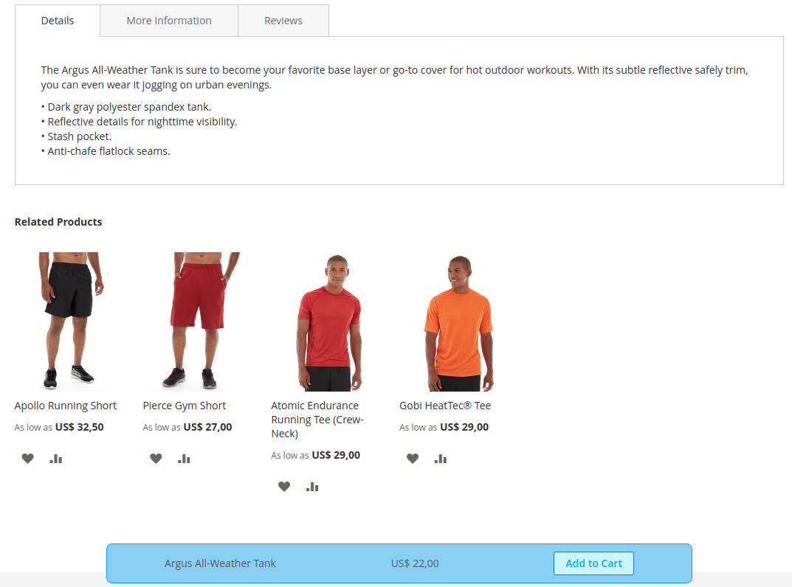
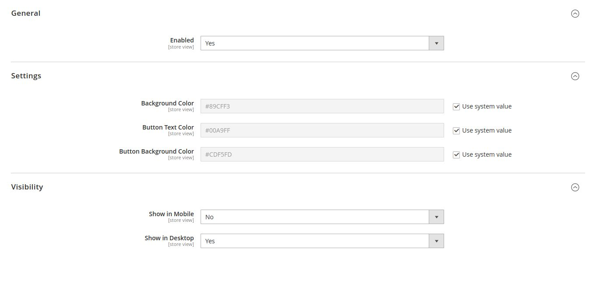

# Hibrido Toolbar Product Information Module

## Description

The Hibrido Toolbar Product Information module extends the admin interface to include additional fields for managing product information, such as enabling/disabling, customizing colors, and specifying visibility on mobile and desktop devices. It also introduces a toolbar on the product page that remains visible when scrolling down and hides when scrolling back up.

## Features

- Enable/Disable Product Information
- Customize Background Color
- Customize Button Text Color
- Customize Button Background Color
- Set Visibility on Mobile and Desktop

## Installation

To install this module, follow these steps:

```bash
php bin/magento module:enable Hibrido_ToolbarProductInformation
php bin/magento setup:upgrade
php bin/magento setup:static-content:deploy -f
```

## Installation

1. Log in to the Magento Admin Panel.
2. Navigate to Stores > Configuration > Hibrido Product Information.
3. Customize the module settings to fit your requirements.

## Preview



## Contributing

We welcome contributions from the community. To contribute, follow these steps:

Fork the repository.
Create a new branch.
Make your changes and commit them.
Push to your fork and submit a pull request.

## Suport

Support
If you encounter any issues or have questions, please feel free to create an issue.
